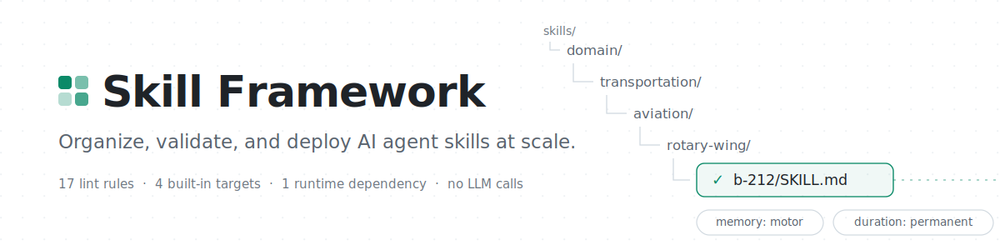

<div align="center">

<picture>
  <source media="(prefers-color-scheme: dark)" srcset="docs/assets/hero-dark.svg">
  
</picture>

[](https://github.com/karsonenns/skill-framework/actions/workflows/ci.yml)
[](https://www.npmjs.com/package/skillfw)


[](LICENSE)

**One source tree of skills, compiled to every runtime that reads `SKILL.md`.**

</div>

The [Agent Skills spec](https://agentskills.io) defines a single skill folder
— and stops there. Nothing defines how hundreds of skills compose into an
organization, so teams get duplicated context, token bloat, committed
credentials, and no idea whether the skills an agent is running match the
repo. Skill Framework is that missing layer: a **convention**, a **linter**
that enforces it in CI, and a **deploy engine** that compiles one source tree
to every runtime that reads `SKILL.md`. Fully offline; no LLM calls.

```sh
npx skillfw init && sf lint && sf deploy --dry-run
```

<picture>
  <source media="(prefers-color-scheme: dark)" srcset="docs/assets/demo-dark.svg">
  
</picture>

## The convention

Skills are classified on four axes — a **domain** taxonomy of any depth, the
**outcomes** they combine into, a **memory type**, and a **duration**:

```
skills/
├── domain/                                  # capabilities — the NOUNS
│   └── transportation/aviation/rotary-wing/
│       └── b-212/SKILL.md                   #   memory: motor, duration: permanent
├── outcome/                                 # end states — the VERBS
│   └── extract-team-from-rooftop/SKILL.md   #   memory: judgment; uses: [b-212, …]
└── references/                              # shared knowledge, linked never copied
```

`memory:` is one of `knowledge | perception | procedure | motor | judgment`;
`duration:` is one of `session-only | temporary | reinforced | permanent`.
Both are lint-enforced vocabularies. Full spec: [docs/convention.md](docs/convention.md).

## What `sf` does

| Command | What it does |
|---|---|
| **`sf lint`** | 17 rules with fix hints: naming, dead links, token budgets, hardcoded credentials, undeclared secrets, spec limits. Runs on *any* directory of skills — try `npx skillfw lint .claude/skills`. JSON/GitHub output; exit 1 on errors; a reusable [GitHub Action](action/). |
| **`sf deploy`** | Compiles the tree to **Claude Code, Codex CLI, Gemini CLI, Cursor** — and anything reading `SKILL.md`. Flattens, rewrites links, keeps output 100% spec-pure, verifies secrets resolve without ever embedding values, and tracks everything in a committed lockfile. `--dry-run` shows a Terraform-style plan. |
| **`sf diff`** | Drift detection: stale deploys, hand-edited targets, missing files. Exit 1 on drift, CI-ready. |
| **`sf init`** / **`sf new`** | Scaffold a lint-clean tree and templates that pass immediately. |

## Contributing

Marketplaces distribute skills; Skill Framework organizes and governs the
ones your org runs. New lint rules, deploy targets, and secret providers are
each a few lines plus a test — see [CONTRIBUTING.md](CONTRIBUTING.md).

[MIT](LICENSE).
